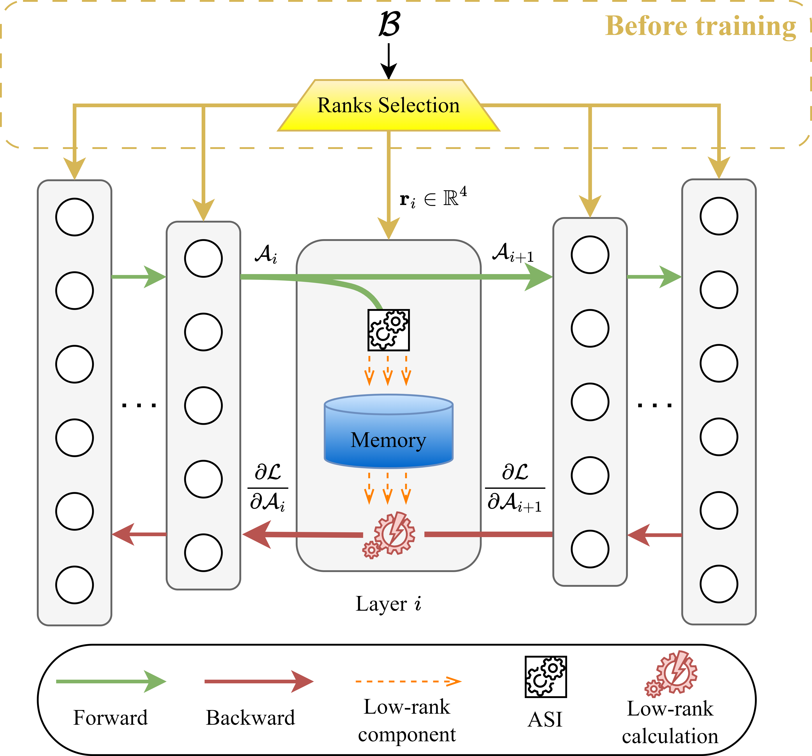
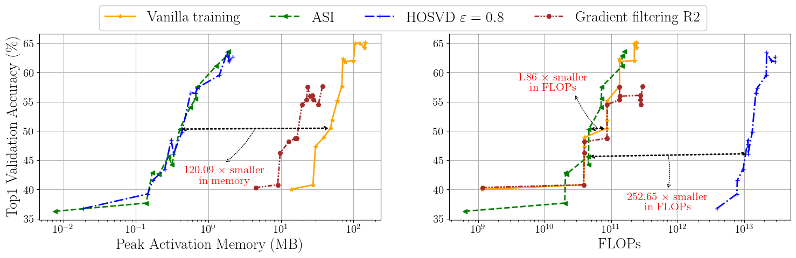

# Beyond Low-rank Decomposition: A Shortcut Approach for Efficient On-Device Learning

> Le-Trung Nguyen, Aël Quélennec, Van-Tam Nguyen, Enzo Tartaglione

Official repository for the paper `Beyond Low-rank Decomposition: A Shortcut Approach for Efficient On-Device Learning` accepted in ICML 2025.

<details><summary>Abstract</summary>

On-device learning has emerged as a promising direction for AI development, particularly because of its potential to reduce latency issues and mitigate privacy risks associated with device-server communication, while improving energy efficiency. Despite these advantages, significant memory and computational constraints still represent major challenges for its deployment. Drawing on previous studies on low-rank decomposition methods that address activation memory bottlenecks in backpropagation, we propose a novel shortcut approach as an alternative. Our analysis and experiments demonstrate that our method can reduce activation memory usage, even up to $120.09\times$ compared to vanilla training, while also reducing overall training FLOPs up to $1.86\times$ when evaluated on traditional benchmarks.

</details>

## Features
### Activation Subspace Iteration (ASI)
Backpropagation is the most memory-intensive step in training deep learning models. Building on previous studies of the low-rank structure and stability of activation maps, we propose an efficient method that projects activation maps into a low-rank space. This approach reduces both memory usage and computational cost during training, while preserving acceptable model performance.

<p align="center">
  
</p>

### Significantly better Pareto curve
At the same accuracy level, our method (ASI) saves up to $120.09\times$ memory compared to vanilla training, while reducing computational cost by up to $1.86\times$. Compared to the state-of-the-art method ($\text{HOSVD}_\varepsilon$), ASI achieves a similar memory compression ratio but reduces computational cost by up to $252.65\times$.

<p align="center">
  
</p>


## Environment Setup
> Experiments were conducted on Ubuntu 22.04.4 LTS.

1. Install the Miniconda environment by following the instructions [here](https://docs.anaconda.com/miniconda/)

2. Create and activate conda virtual environment

```
conda create -n asi python=3.8
conda activate asi
```
3. Install requirements

```
pip install -r requirements.txt
```
4. Install CUDA 11.7

```
conda install -c "nvidia/label/cuda-11.7.1" cuda-toolkit
```

5. Install PyTorch 1.13.1

```
conda install pytorch==1.13.1 torchvision==0.14.1 pytorch-cuda=11.7 -c pytorch -c nvidia
```

### Classification

0. Make sure to be inside [classification](classification/) folder

```
cd classification
```

1. Install dependencies for the classification task

```
pip install "jsonargparse[signatures]" pytorch_lightning==1.6.5 torchmetrics==0.9.2 pretrainedmodels
```

2. Prepare checkpoints for setup B

```
gdown https://drive.google.com/uc?id=1N2lOOxaepwbEuwIi7xEEBZwov8pb3jEJ
tar xzvf cls_pretrained_ckpts.tar.gz
rm cls_pretrained_ckpts.tar.gz
```

3. Running experiments

  

In the [scripts](classification/scripts) directory, you can find pre-configured bash files to run the corresponding experiments. For example, to run experiments with ASI on Setup A, first measure the perplexity by running:

```bash
bash scripts/conv_models/ASI/measure_perplexity/measure_perplexity_setupA_conv.sh
```

Then, run the experiments with:

```bash
bash scripts/conv_models/ASI/setupA/mbv2_ASI_various_data.sh
bash scripts/conv_models/ASI/setupA/mcunet_ASI_various_data.sh
bash scripts/conv_models/ASI/setupA/resnet18_ASI_various_data.sh
bash scripts/conv_models/ASI/setupA/resnet34_ASI_various_data.sh
```

**Note:** For more details regarding experiment setup changes and logging resource consumption, please refer to [here](classification/README.md).

  

### Segmentation

0. Make sure to be inside [segmentation](segmentation/) folder

```
cd segmentation
```

1. Install dependencies for semantic segmentation

```
pip install opencv-python
pip install openmim
mim install mmcv-full==1.6.1
cd mmsegmentation
pip install -e .
cd ..
```

2. Prepare dataset

* VOC12 Aug:

```
wget http://host.robots.ox.ac.uk/pascal/VOC/voc2012/VOCtrainval_11-May-2012.tar
tar xvf VOCtrainval_11-May-2012.tar
rm VOCtrainval_11-May-2012.tar

wget https://www2.eecs.berkeley.edu/Research/Projects/CS/vision/grouping/semantic_contours/benchmark.tgz
tar xvf benchmark.tgz
rm benchmark.tgz

mkdir mmsegmentation/data
mkdir VOCdevkit/VOCaug
mv benchmark_RELEASE/dataset VOCdevkit/VOCaug
mv VOCdevkit mmsegmentation/data

cd mmsegmentation
python tools/convert_datasets/voc_aug.py data/VOCdevkit data/VOCdevkit/VOCaug --nproc 8

mv data ./../
cd ..

rm -r benchmark_RELEASE
```

* Cityscapes: Please refer to [here](https://mmsegmentation.readthedocs.io/en/0.x/dataset_prepare.html).


3. Prepare checkpoint

```
gdown https://drive.google.com/uc?id=1CxLWBcByKFS-Vv75VG70DWUX3EcFmSu1
tar xvf seg_calib_ckpt.tar.gz
rm seg_calib_ckpt.tar.gz
```

4. Running experiments

Similar to the classification tasks, the corresponding bash files can be found in [scripts](segmentation/scripts).

**Note:** For more details, please refer to [here](segmentation/README.md).
